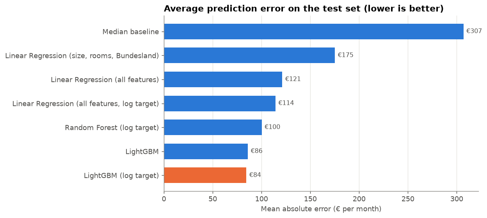
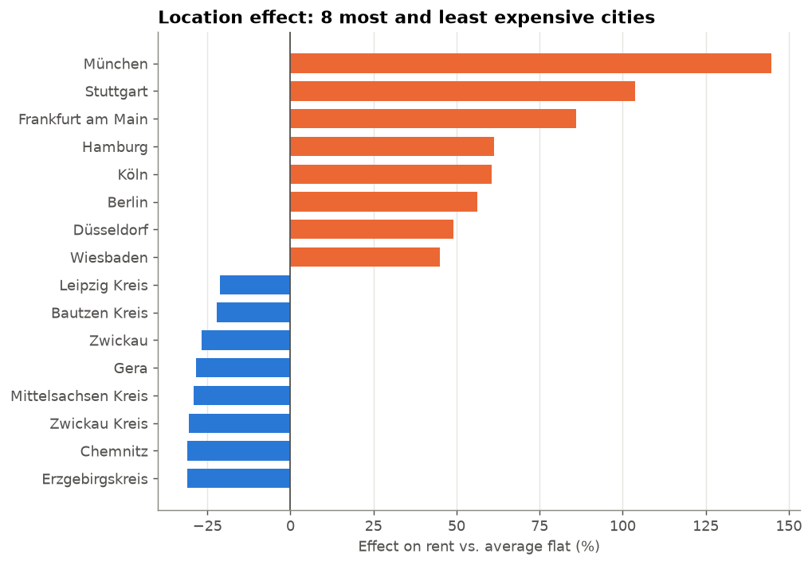

# Rent Price Predictor (Germany)

Machine learning project that predicts the base rent (Kaltmiete) of German apartments
from their features, with a Streamlit web app to try it out.

## Results
The final model (LightGBM on log(rent)) is off by **€84.5 on average** on apartments it has never seen
(median error **9.3%**, R² **0.896**) – the "always predict the median" baseline is off by €307.

| Model | Test MAE (€) | Test R² |
|---|---|---|
| Median baseline | 306.9 | −0.107 |
| Linear Regression (size, rooms, Bundesland) | 175.2 | 0.653 |
| Linear Regression (all features) | 121.3 | 0.819 |
| Random Forest (log target) | 100.2 | 0.854 |
| **LightGBM (log target)** | **84.5** | **0.896** |



## What drives rent?
SHAP analysis of the final model (`notebooks/03_explainability.ipynb`):
- **Living space and city** explain almost everything (58% and 31% of the model's gain).
- **Location:** with all else equal, München is +145% vs. the average flat, Stuttgart +104%, Frankfurt +86%, Berlin +56%;
  regions in Saxony and Thuringia (Chemnitz, Zwickau, Gera) about −30%.
- **Construction year** has a U-shape: buildings from 1970–1990 are cheapest, new buildings (after 2010) about +12%.
- **Extras:** fitted kitchen +7%, lift +6%, balcony +4%; luxury interior +15%, penthouse +8%.



## Data
Kaggle dataset ["Apartment rental offers in Germany"](https://www.kaggle.com/datasets/corrieaar/apartment-rental-offers-in-germany)
(ImmoScout24 listings, 2018–2020, ~268,000 rows).
Download `immo_data.csv` and place it in `data/` (this folder is not tracked by Git).

Cleaning (`src/cleaning.py`): duplicate listings removed, leakage columns (total rent, service charges) dropped,
unrealistic values filtered (rent €100–5,000, 10–300 m², 1–10 rooms).

## Project structure
```
app/app.py                       Streamlit app
notebooks/01_exploration.ipynb   Phases 1–2: data exploration and cleaning
notebooks/02_modeling.ipynb      Phases 3–4: baselines and model comparison
notebooks/03_explainability.ipynb Phase 5: feature importance and SHAP
src/cleaning.py                  Reusable cleaning and feature preparation
src/train.py                     Trains and saves the final model
models/rent_model.joblib         Trained model used by the app
reports/model_results.csv        Model comparison table
```

## Setup
```bash
python -m venv .venv
.venv\Scripts\activate        # Windows
pip install -r requirements.txt
```

## Usage
```bash
python src/train.py           # optional: retrain the model (needs data/immo_data.csv)
streamlit run app/app.py      # start the app
```
The app shows the estimated rent, a typical range and **why** – how much each feature raises or lowers the price.

## Limitations
- Listings from 2018–2020: today's rents are likely higher.
- Asking rents from listings, not signed contracts.
- Location is only known at city/district level, not by neighbourhood.
